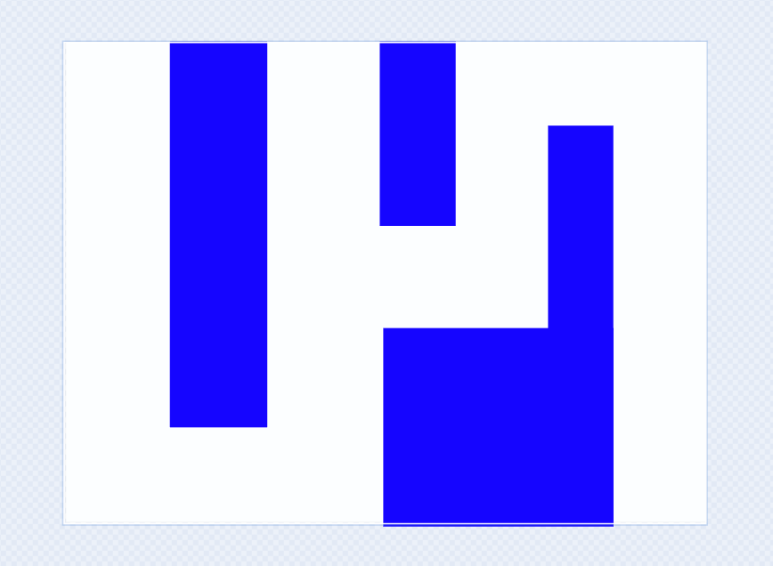
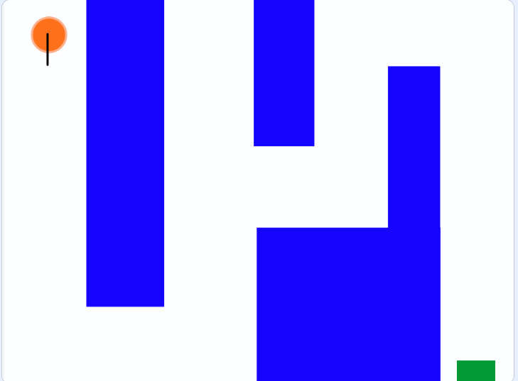

# Mazes, part 1

## Making a maze

1. Open scratch
1. Select the `backdrops` tab 
1. Make your own maze backdrop using the lines or shapes. Below is an example of a backdrop:

1. Add a goal sprite for the goal position. Ours is the green square in the below image:

1. Add a character sprite to your maze. Make sure your character has a front! Our is shown in orange in the above image. 

# **Check your maze map with a facilitator.**

[go to part 2](./scratch_maze_part2.md)