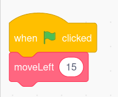

# Mazes, part 2

## Make some myBlocks

Select your character sprite. 

It will be easier to write your maze with some MyBlocks. Create a MyBlock called "Move Left" and **add an input (number or text)** called `distance`. This is going to be the distance that your character moves. 

In this MyBlock, the character should turn in the left direction and move by `distance` units. 

Test your MyBlock. You can do this by attaching it to the "When green flag is clicked" events block, and adding some distance:

What happens when you change the distance?

**Check your function with a facilitator**

Can you make three more My Blocks, for moving right, moving up, and moving down?

## Move your character around

When you press an arrow, your character should move around using that arrow. 

1. When you press the "up" arrow, your character should move up by 10 units. You can use your My Block!  (Hint: There's a yellow "events" block that can help with the arrow press)

1. When you press the "left" arrow, your character should move to the left by 10 units. 

1. When you press the "down" arrow, your character should move down by 10 units. 

1. When you press the "right" arrow, your character should move right by 10 units. 

Can you solve your maze? What happens when you direct your character over one of your obstacles?

When your character touches some of your obstacles, it should bounce backwards. 

1. Make sure that when your character touches an obstacle color, it bounces backwards.

1. Try to solve your maze. 

# **Check your maze solve with a facilitator.**
[Go to part 3](./scratch_maze_part3.md)